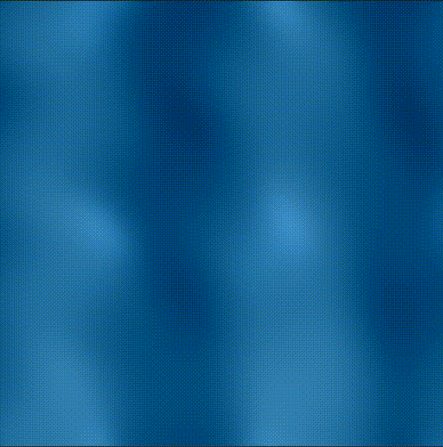
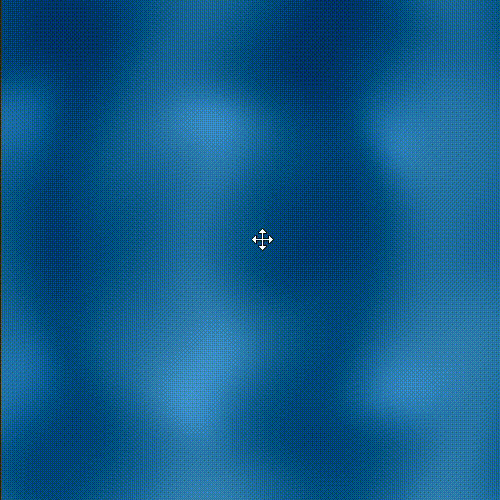

# IG: Entregable semana 9 y 10: Shaders

## Introducción

Se nos pide desarrollar un shader de fragmentos con patrones generativo, asegurando que sea ejecutable de editor de [The Book of Shaders](https://editor.thebookofshaders.com/). Para el shader se me ocurrió como idea, generar un patrón que simule el movimiento del agua.

## Motivación
Este shader se podría usar (adaptandolo un poco), a muchos escenarios tales como:

- En el proyecto que hicimos del sistema solar, para que La Tierra tuviera este shader en las zonas donde hay agua.
- En una demo de un juego que en algún escenario estuviera este shader. Como por ejemplo, en un mar abierto o en una piscina.

## Desarrollo
Primero se definen los uniforms:
```glsl
uniform float u_time;
uniform vec2 u_resolution,u_mouse;
```
Cada uno tiene su función que se describe a continuación:

- u_time: Se usa para animar el patrón dinámicamente.
- u_resolution: Resolución de la pantalla o canvas (ancho y alto). Se usa para normalizar coordenadas de píxeles.
- u_mouse: Permite la interacción con el patrón, mediante el ratón.
    
Luego, las coordenadas normalizadas del píxel

```glsl
vec2 u=gl_FragCoord.xy/u_resolution*2.-1.; 
u.x*=u_resolution.x/u_resolution.y;
```
Básicamente, este bloque transforma las coordenadas a [-1,1] y corrige la distorsión de aspecto, para que el patrón no se vea estirado.

Por consiguiente, se definen coordenadas normalizadas del ratón
```glsl
vec2 m=u_mouse/u_resolution*2.-1.; 
m.x*=u_resolution.x/u_resolution.y;
```
Esto permite que el patrón reaccione a la posición del cursor.

Siguiente a esto se consigue el desplazamiento dinámico
```glsl
u+=sin(length(u-m)*10.-u_time*4.)*.05;
```
Que básicamente calcula la distancia desde el píxel actual al ratón, genera una onda circular que se mueve con el tiempo y crea un patrón ondulado basado en esa distancia.

Y luego, escala la intensidad del desplazamiento y modifica las coordenadas para que las ondas afecten el patrón final, simulando el "agua”.

Por último, se calcula el color:
```glsl
gl_FragColor=vec4(
    vec3(.05,.35,.55)-u.y*.04
    +sin(u.x*6.+u_time)*.1
    +cos(u.y*8.+u_time)*.02
    +vec3(.2,.25,.3)*pow(max(0.,sin(u.x*8.+u_time)+cos(u.y*6.-u_time)),3.)*.05,
1.);
```
Este bloque define color base, que es azul verdoso, también define que los píxeles de más arriba son ligeramente más oscuros o claros, simulando profundidad. Con la función seno, define la ondulación horizontal animada con el tiempo, con la función coseno hace la ondulación vertical más sutil. Y por último, se acentúa los picos del patrón para dar textura y se define la parte especular para generar destellos o burbujas más localizados y brillantes.

## Resultado final
<p align="center">
  
  &nbsp;&nbsp;&nbsp;
  
</p>
<p align="center">
  Resultado final sin distorsión de onda &nbsp;&nbsp;&nbsp;&nbsp;&nbsp;&nbsp;&nbsp;&nbsp;&nbsp;&nbsp;&nbsp;&nbsp;&nbsp;&nbsp;
  Resultado final con distorsión de onda
</p>